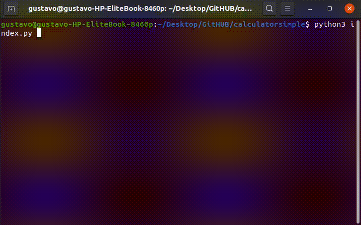

# HISOKA SIMPLE CALCULATOR

Neste repositório, trago o código fonte de uma calculadora de operações simples.
O objetivo deste repositório é ajudar a comunidade a se desenvolver , além de manter afiada minhas habilidades desenvolvendo usando a linguagem Python.

## Versões

**22/08/2020**

- [x] Operações de soma com 2 variáveis.
- [x] Operações de subtracao com 2 variaveis.
- [x] Operações de divisão com 2 variaveis.
- [x] Operações de multiplicação com 2 variaveis.

## Ideias para possiveis atualizacoes 

- [ ] Demonstrar passo a passo de maneira didática a resolução das equações.
- [ ] Adicionar operações com frações comuns.
- [ ] Adicionar operações com frações geratrizes.

## Como usar

- Após clonar o repositório, use o seguinte comando: $ python3 index.py , e siga as instruções.

## Documentacao e explicacao da versao atual:
[Artigo Linkedin](#)
